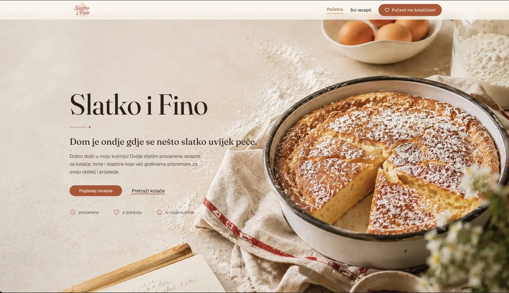

# Slatko i Fino

A recipe website for a home baker — built end-to-end as a personal project, from CMS to production.

**[slatkoifino.com](https://slatkoifino.com)** — live in production



## What this is

A Croatian-language baking blog with an editorial, cookbook-inspired design system. What started as a generic starter template was redesigned section by section — homepage, recipe listing, and recipe detail — into one coherent visual language with a shared component library, rather than three different-looking pages bolted together.

The repo is public so it can be used as a reference, and so the actual code is visible, not just the finished site.

## Stack

- **Framework** — Next.js 15 (App Router, Server Components, ISR via `revalidate`)
- **CMS** — [Strapi](https://strapi.io) (headless, separate repo), fetched at request time
- **Styling** — Tailwind CSS v4 (CSS-first config, no `tailwind.config.js`), shadcn/ui primitives
- **Media** — Cloudinary, through a small custom `next/image` loader
- **Monitoring** — Sentry
- **Language** — TypeScript throughout

## A few things worth pointing out

- **One shared `RecipeCard` / `RecipeMeta` / `SectionHeading` system**, reused as-is across the homepage, the recipe listing, and related-recipes — not three separate card implementations.
- **A gallery that respects real content.** The author uploads unedited phone photos, landscape or portrait. The gallery reads each image's own dimensions and only crops when it's actually safe to — a portrait photo is shown in full rather than forced into a landscape frame.
- **Native sharing with a real fallback.** Uses the Web Share API where supported, and degrades to a small accessible menu (Facebook / WhatsApp / Viber / copy link) everywhere else, with no assumption that any particular app is installed.
- **A content model that matches how it's actually used.** The author only ever fills in a title, photos, ingredients, and steps — no required description, excerpt, or SEO fields. The UI is designed to look complete with just that.

## Running locally

```bash
npm install
cp .env.example .env
```

You'll need a Strapi instance (or the [API repo](https://strapi.io) locally) and to fill in `API_URL` and `STRAPI_TOKEN` in `.env`.

```bash
npm run dev
```

Open [http://localhost:3000](http://localhost:3000).

## Project structure

```
src/
  app/(subpages)/     # routes: homepage, /recepti, /recept/[slug]
  components/          # shared UI — RecipeCard, SectionHeading, ui/ primitives
  types/                # Strapi content-type shapes
```
